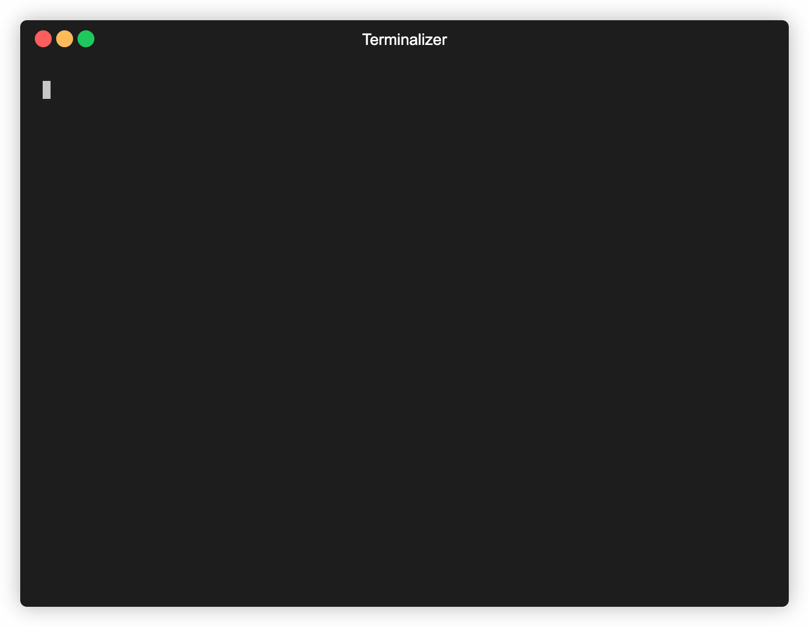
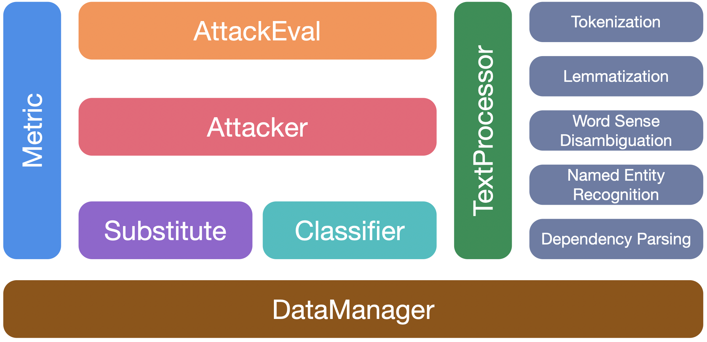

<h1 align="center">OpenAttack</h1>
<p align="center">
  <a target="_blank">
    
  </a>
  <a href="https://openattack.readthedocs.io/" target="_blank">
    
  </a>
  <a  href="https://pypi.org/project/OpenAttack/"  target="_blank">
    
  </a>
  <a  href="https://github.com/thunlp/OpenAttack/releases"  target="_blank">
      
  </a>
  <a target="_blank">
    
  </a>
   <a target="_blank">
    
  </a>
<br><br>
  <a href="https://openattack.readthedocs.io/" target="_blank">Documentation</a> • <a href="#features--uses">Features & Uses</a> • <a href="#usage-examples">Usage Examples</a> • <a href="#attack-models">Attack Models</a> • <a href="#toolkit-design">Toolkit Design</a> 
<br>
</p>

OpenAttack is an open-source Python-based textual adversarial attack toolkit, which handles the whole process of textual adversarial attacking, including preprocessing text, accessing the victim model, generating adversarial examples and evaluation. 

## Features & Uses

#### OpenAttack has the following features:

⭐️ **Support for all attack types**. OpenAttack supports all types of attacks including sentence-/word-/character-level perturbations and gradient-/score-/decision-based/blind attack models;

⭐️ **Multilinguality**. OpenAttack supports English and Chinese now. Its extensible design enables quick support for more languages;

⭐️ **Parallel processing**. OpenAttack provides support for multi-process running of attack models to improve attack efficiency;

⭐️ **Compatibility with 🤗 Hugging Face**. OpenAttack is fully integrated with 🤗 [Transformers](https://github.com/huggingface/transformers) and [Datasets](https://github.com/huggingface/datasets) libraries;

⭐️ **Great extensibility**. You can easily attack a customized <u>victim model</u> on any customized <u>dataset</u> or develop and evaluate a customized <u>attack model</u>.


#### OpenAttack has a wide range of uses, including:

✅ Providing various handy **baselines** for attack models; 

✅ Comprehensively **evaluating** attack models using its thorough evaluation metrics; 

✅ Assisting in quick development of **new attack models** with the help of its common attack components; 

✅ Evaluating the **robustness** of a machine learning model against various adversarial attacks; 

✅ Conducting **adversarial training** to improve robustness of a machine learning model by enriching the training data with generated adversarial examples.

## Installation

#### 1. Using `pip` (recommended)

```bash
pip install OpenAttack
```

#### 2. Cloning this repo

```bash
git clone https://github.com/thunlp/OpenAttack.git
cd OpenAttack
python setup.py install
```

After installation, you can try running `demo.py` to check if OpenAttack works well:

```
python demo.py
```


## Usage Examples

#### Use Built-in Attacks

OpenAttack builds in some commonly used text classification models such as LSTM and BERT as well as datasets such as [SST](https://nlp.stanford.edu/sentiment/treebank.html) for sentiment analysis and [SNLI](https://nlp.stanford.edu/projects/snli/) for natural language inference. You can effortlessly conduct adversarial attacks against the built-in victim models on the datasets.

The following code snippet shows how to use a genetic algorithm-based attack model ([Alzantot et al., 2018](https://www.aclweb.org/anthology/D18-1316.pdf)) to attack BERT on the SST dataset:

```python
import OpenAttack as oa
# choose a trained victim classification model
victim = oa.DataManager.load("Victim.BERT.SST")
# choose an evaluation dataset 
dataset = oa.DataManager.load("Dataset.SST.sample")
# choose Genetic as the attacker and initialize it with default parameters
attacker = oa.attackers.GeneticAttacker() 
# prepare for attacking
attack_eval = oa.attack_evals.DefaultAttackEval(attacker, victim)
# launch attacks and print attack results 
attack_eval.eval(dataset, visualize=True)
```

<details>
<summary><strong>Customized Victim Model</strong></summary>

The following code snippet shows how to use the genetic algorithm-based attack model to attack a customized sentiment analysis model (a statistical model built in NLTK) on SST.

```python
import OpenAttack as oa
import numpy as np
from nltk.sentiment.vader import SentimentIntensityAnalyzer

# configure access interface of the customized victim model
class MyClassifier(oa.Classifier):
    def __init__(self):
        self.model = SentimentIntensityAnalyzer()
    # access to the classification probability scores with respect input sentences
    def get_prob(self, input_): 
        rt = []
        for sent in input_:
            rs = self.model.polarity_scores(sent)
            prob = rs["pos"] / (rs["neg"] + rs["pos"])
            rt.append(np.array([1 - prob, prob]))
        return np.array(rt)

# choose the costomized classifier as the victim model
victim = MyClassifier()
# choose an evaluation dataset 
dataset = oa.DataManager.load("Dataset.SST.sample")
# choose Genetic as the attacker and initialize it with default parameters
attacker = oa.attackers.GeneticAttacker()
# prepare for attacking
attack_eval = oa.attack_evals.DefaultAttackEval(attacker, victim)
# launch attacks and print attack results 
attack_eval.eval(dataset, visualize=True)
```
</details>


<details>
<summary><strong>Customized Dataset</strong></summary>
Test
</details>

<details>
<summary><strong>Chinese Attack</strong></summary>
Test
</details>

<details>
<summary><strong>Customized Attack Model</strong></summary>

OpenAttack incorporates many handy components which can be easily assembled into new attack model. 

[Here](./examples/custom_attacker.py) gives an example of how to design a simple attack model which shuffles the tokens in the original sentence.
</details>

<details>
<summary><strong>Adversarial Training</strong></summary>

OpenAttack can easily generate adversarial examples by attacking instances in the training set, which can be added to original training data set to retrain a more robust victim model, i.e., adversarial training. 

[Here](./examples/adversarial_training.py)  gives an example of how to conduct adversarial training with OpenAttack.
</details>

<details>
<summary><strong>More Examples</strong></summary>

- Customized Evaluation Metric. OpenAttack supports designing a customized adversarial attack evaluation metric. [Here](./examples/custom_eval.py) gives an example of how to add BLEU score as a customized evaluation metric to evaluate adversarial attacks.

- Attack Sentence Pair Classification Models
</details>


## Attack Models

According to the level of perturbations imposed on original input, textual adversarial attack models can be categorized into sentence-level, word-level, character-level attack models. 

According to the accessibility to the victim model, textual adversarial attack models can be categorized into `gradient`-based, `score`-based, `decision`-based and `blind` attack models.

> [TAADPapers](https://github.com/thunlp/TAADpapers) is a paper list which summarizes almost all the papers concerning textual adversarial attack and defense. You can have a look at this list to find more attack models.

Currently OpenAttack includes 15 typical attack models against text classification models that cover **all** attack types. 

Here is the list of currently involved attack models.

- Sentence-level
  - (SEA) **Semantically Equivalent Adversarial Rules for Debugging NLP Models**. *Marco Tulio Ribeiro, Sameer Singh, Carlos Guestrin*. ACL 2018. `decision` [[pdf](https://aclweb.org/anthology/P18-1079)] [[code](https://github.com/marcotcr/sears)]
  - (SCPN) **Adversarial Example Generation with Syntactically Controlled Paraphrase Networks**. *Mohit Iyyer, John Wieting, Kevin Gimpel, Luke Zettlemoyer*. NAACL-HLT 2018. `blind` [[pdf](https://www.aclweb.org/anthology/N18-1170)] [[code&data](https://github.com/miyyer/scpn)]
  - (GAN) **Generating Natural Adversarial Examples**. *Zhengli Zhao, Dheeru Dua, Sameer Singh*. ICLR 2018. `decision` [[pdf](https://arxiv.org/pdf/1710.11342.pdf)] [[code](https://github.com/zhengliz/natural-adversary)]
- Word-level
  - (TextFooler) **Is BERT Really Robust? A Strong Baseline for Natural Language Attack on Text Classification and Entailment**. *Di Jin, Zhijing Jin, Joey Tianyi Zhou, Peter Szolovits*. AAAI-20. `score` [[pdf](https://arxiv.org/pdf/1907.11932v4)] [[code](https://github.com/wqj111186/TextFooler)]
  - (PWWS) **Generating Natural Language Adversarial Examples through Probability Weighted Word Saliency**. *Shuhuai Ren, Yihe Deng, Kun He, Wanxiang Che*. ACL 2019. `score` [[pdf](https://www.aclweb.org/anthology/P19-1103.pdf)] [[code](https://github.com/JHL-HUST/PWWS/)]
  - (Genetic) **Generating Natural Language Adversarial Examples**. *Moustafa Alzantot, Yash Sharma, Ahmed Elgohary, Bo-Jhang Ho, Mani Srivastava, Kai-Wei Chang*. EMNLP 2018. `score` [[pdf](https://www.aclweb.org/anthology/D18-1316)] [[code](https://github.com/nesl/nlp_adversarial_examples)]
  - (SememePSO) **Word-level Textual Adversarial Attacking as Combinatorial Optimization**. *Yuan Zang, Fanchao Qi, Chenghao Yang, Zhiyuan Liu, Meng Zhang, Qun Liu and Maosong Sun*. ACL 2020. `score` [[pdf](https://www.aclweb.org/anthology/2020.acl-main.540.pdf)] [[code](https://github.com/thunlp/SememePSO-Attack)]
  - (BERT-ATTACK) **BERT-ATTACK: Adversarial Attack Against BERT Using BERT**. *Linyang Li, Ruotian Ma, Qipeng Guo, Xiangyang Xue, Xipeng Qiu*. EMNLP 2020. `score` [[pdf](https://www.aclweb.org/anthology/2020.emnlp-main.500.pdf)] [[code](https://github.com/LinyangLee/BERT-Attack)]
  - (BAE) **BAE: BERT-based Adversarial Examples for Text Classification**. *Siddhant Garg, Goutham Ramakrishnan. EMNLP 2020*. `score` [[pdf](https://www.aclweb.org/anthology/2020.emnlp-main.498.pdf)] [[code](https://github.com/QData/TextAttack/blob/master/textattack/attack_recipes/bae_garg_2019.py)]
  - (FD) **Crafting Adversarial Input Sequences For Recurrent Neural Networks**. *Nicolas Papernot, Patrick McDaniel, Ananthram Swami, Richard Harang*. MILCOM 2016. `gradient` [[pdf](https://arxiv.org/pdf/1604.08275.pdf)]
- Word/Char-level
  - (TextBugger) **TEXTBUGGER: Generating Adversarial Text Against Real-world Applications**. *Jinfeng Li, Shouling Ji, Tianyu Du, Bo Li, Ting Wang*. NDSS 2019. `gradient` `score` [[pdf](https://arxiv.org/pdf/1812.05271.pdf)]
  - (UAT) **Universal Adversarial Triggers for Attacking and Analyzing NLP.** *Eric Wallace, Shi Feng, Nikhil Kandpal, Matt Gardner, Sameer Singh*. EMNLP-IJCNLP 2019. `gradient` [[pdf](https://arxiv.org/pdf/1908.07125.pdf)] [[code](https://github.com/Eric-Wallace/universal-triggers)] [[website](http://www.ericswallace.com/triggers)]
  - (HotFlip) **HotFlip: White-Box Adversarial Examples for Text Classification**. *Javid Ebrahimi, Anyi Rao, Daniel Lowd, Dejing Dou*. ACL 2018. `gradient` [[pdf](https://www.aclweb.org/anthology/P18-2006)] [[code](https://github.com/AnyiRao/WordAdver)]
- Char-level
  - (VIPER) **Text Processing Like Humans Do: Visually Attacking and Shielding NLP Systems**. *Steffen Eger, Gözde Gül ¸Sahin, Andreas Rücklé, Ji-Ung Lee, Claudia Schulz, Mohsen Mesgar, Krishnkant Swarnkar, Edwin Simpson, Iryna Gurevych*. NAACL-HLT 2019. `score` [[pdf](https://www.aclweb.org/anthology/N19-1165)] [[code&data](https://github.com/UKPLab/naacl2019-like-humans-visual-attacks)]
  - (DeepWordBug) **Black-box Generation of Adversarial Text Sequences to Evade Deep Learning Classifiers**. *Ji Gao, Jack Lanchantin, Mary Lou Soffa, Yanjun Qi*. IEEE SPW 2018. `score` [[pdf](https://ieeexplore.ieee.org/document/8424632)] [[code](https://github.com/QData/deepWordBug)]

The following table illustrates the comparison of the attack models.

|    Model    |  Accessibility  | Perturbation | Main Idea                                           |
| :---------: | :-------------: | :----------: | :-------------------------------------------------- |
|     SEA     |    Decision     |   Sentence   | Rule-based paraphrasing                             |
|    SCPN     |      Blind      |   Sentence   | Paraphrasing                                        |
|     GAN     |    Decision     |   Sentence   | Text generation by encoder-decoder                  |
| TextFooler  |      Score      |     Word     | Greedy word substitution                            |
|    PWWS     |      Score      |     Word     | Greedy word substitution                            |
|   Genetic   |      Score      |     Word     | Genetic algorithm-based word substitution           |
|  SememePSO  |      Score      |     Word     | Particle Swarm Optimization-based word substitution |
|  BERT-ATTACK  |      Score      |     Word     | Greedy contextualized word substitution |
|  BAE  |      Score      |     Word     | Greedy contextualized word substitution and insertion |
|     FD      |    Gradient     |     Word     | Gradient-based word substitution                    |
| TextBugger  | Gradient, Score |  Word+Char   | Greedy word substitution and character manipulation |
|     UAT     |    Gradient     |  Word, Char  | Gradient-based word or character manipulation       |
|   HotFlip   |    Gradient     |  Word, Char  | Gradient-based word or character substitution       |
|    VIPER    |      Blind      |     Char     | Visually similar character substitution             |
| DeepWordBug |      Score      |     Char     | Greedy character manipulation                       |

## Toolkit Design

Considering the significant distinctions among different attack models, we leave considerable freedom for the skeleton design of attack models, and focus more on streamlining the general processing of adversarial attacking and the common components used in attack models.

OpenAttack has 7 main modules: 



* **TextProcessor**: processing the original text sequence to assist attack models in generating adversarial examples;
* **Victim**: wrapping victim models;
* **Attacker**: comprising various attack models;
* **AttackAssist**: packing different word/character substitution methods that are used in word-/character-level attack models and some other components used in sentence-level attack models like the paraphrasing model;
* **Metric**: providing several adversarial example quality metrics that can serve as either the constraints on the adversarial examples during attacking or evaluation metrics for evaluating adversarial attacks;
* **AttackEval**: evaluating textual adversarial attacks from attack effectiveness, adversarial example quality and attack efficiency;
* **DataManager**: managing all data and saved models that are used in other modules.

## Citation

Please cite our [paper](https://aclanthology.org/2021.acl-demo.43.pdf) if you use this toolkit:

```
@inproceedings{zeng2020openattack,
  title={{Openattack: An open-source textual adversarial attack toolkit}},
  author={Zeng, Guoyang and Qi, Fanchao and Zhou, Qianrui and Zhang, Tingji and Hou, Bairu and Zang, Yuan and Liu, Zhiyuan and Sun, Maosong},
  booktitle={Proceedings of the 59th Annual Meeting of the Association for Computational Linguistics and the 11th International Joint Conference on Natural Language Processing: System Demonstrations},
  pages={363--371},
  year={2021},
  url={https://aclanthology.org/2021.acl-demo.43},
  doi={10.18653/v1/2021.acl-demo.43}
}
```

## Contributors
We thank all the contributors to this project. And more contributions are very welcome.

<a href="https://github.com/thunlp/OpenAttack/graphs/contributors">
  </a>

